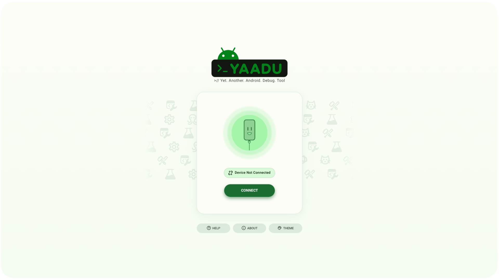
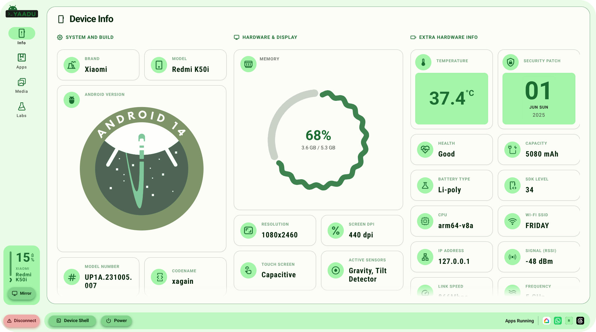
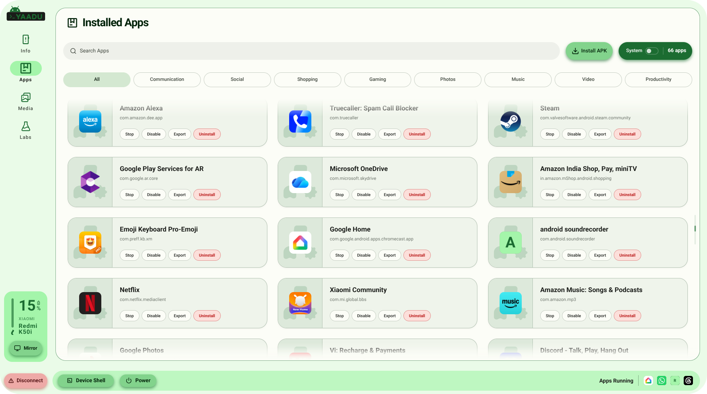
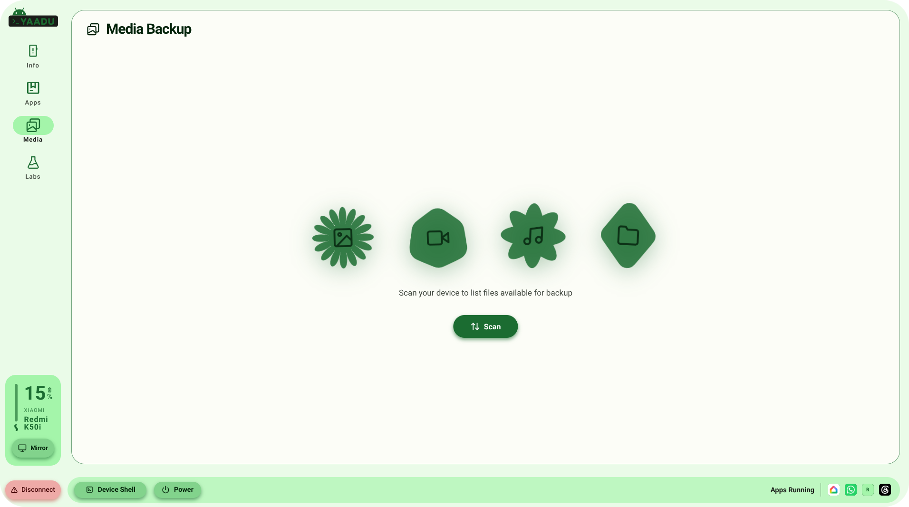
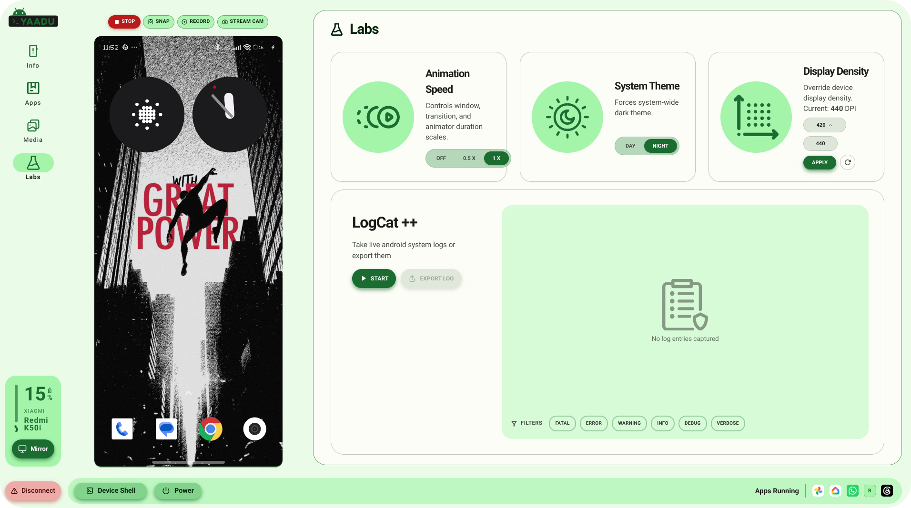

<p align="center">
  
</p>

<h1 align="center">YAADU — Yet Another Android Debug Utility</h1>

<p align="center">
  A fully client-side Android dashboard that communicates with a physical device over USB via the <strong>WebUSB API</strong>.<br>
  No backend, no companion app, no native binaries — just a browser tab.<br>
  Built with <strong>React 19</strong> and <strong>Material 3</strong>.
</p>

---

## Features

### Connect
Plug in your Android device with USB debugging enabled, click connect, and the browser's USB picker handles the rest. YAADU authenticates using standard RSA-2048 ADB key exchange — no `adb` binary required on your machine.



### Device Telemetry
View detailed device information: brand, model, OS version, battery stats, screen resolution, RAM, storage, WiFi details, and active sensors. Memory usage is visualized with a progress ring.



### App Management
Browse user-installed apps with live name resolution. Force stop, clear data, uninstall, or disable/enable apps directly from the browser. Drag-and-drop APK files to sideload them onto the device.



### Media Backup
Scan the device camera folder and download individual files or create a ZIP archive of selected media. Supports cancellation mid-backup.



### System Tweaks
Adjust animation speed, toggle night mode, and change display density (DPI) through `settings` and `wm` shell commands.



---

## Quick Start

```bash
# Install dependencies (Node 18+)
npm install

# Start dev server (http://localhost:5173)
npm run dev

# Production build
npm run build
npm run preview
```

---

## Prerequisites

| Requirement | Details |
|---|---|
| Browser | Chrome 89+ or Edge 89+ on Desktop (macOS / Windows / Linux) |
| USB Debugging | Enabled in **Developer Options** on the Android device |
| Secure Context | Served from `localhost` or HTTPS (WebUSB requirement) |
| ADB port conflict | Stop any local `adb` server first: `adb kill-server` |

---

## Troubleshooting

- **"No devices found" in picker** — Ensure USB debugging is enabled and the cable supports data (not charge-only).
- **"Allow USB Debugging?" never appears** — Run `adb kill-server` on your host and retry.
- **Repeated authorization prompts** — Open DevTools console and run `localStorage.removeItem("yaadu:adb-private-key")`, then reconnect.
- **Permission denied errors** — YAADU runs as the `shell` user; some operations (e.g. uninstalling system apps) require root.

---

## Tech Stack

| Package | Purpose |
|---|---|
| React 19 | UI framework |
| Vite | Build tool |
| TypeScript | Type safety |
| @yume-chan/adb 0.0.19 | ADB daemon protocol over WebUSB |
| @material/web 2.4.1 | Material 3 web components |
| @material/material-color-utilities | Programmatic M3 theme generation |
| jszip | Media backup archive creation |
